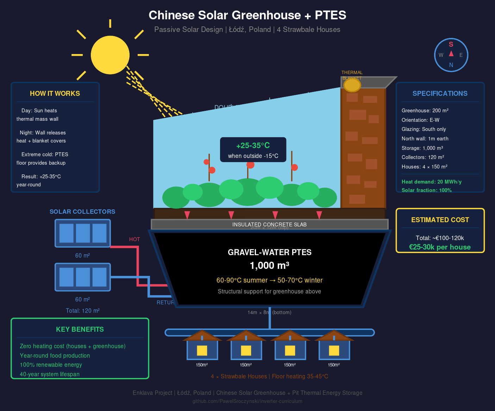

# Chinese Solar Greenhouse + Pit Thermal Energy Storage (PTES)

## Complete Concept for 4-House Strawbale Cluster | Łódź, Poland



---

## Executive Summary

This document presents an integrated heating and food production system combining:

1. **Chinese Solar Greenhouse** - passive solar design from northern China
2. **Pit Thermal Energy Storage (PTES)** - seasonal underground water storage
3. **Solar Thermal Collectors** - primary heat source (ground + wall-mounted)
4. **District Heating Network** - connecting 4 EcoCocon prefab houses

**Result**: 100% solar-heated homes + year-round greenhouse food production with zero fuel costs.

---

## Table of Contents

1. [System Overview](#system-overview)
2. [Design Calculations](#design-calculations)
3. [Chinese Solar Greenhouse](#chinese-solar-greenhouse)
4. [Pit Thermal Energy Storage](#pit-thermal-energy-storage)
5. [Solar Thermal Collectors](#solar-thermal-collectors)
6. [Integration Design](#integration-design)
7. [Technical Specifications](#technical-specifications)
8. [Performance Analysis](#performance-analysis)
9. [Construction Sequence](#construction-sequence)
10. [Cost Estimate](#cost-estimate)
11. [References](#references)

---

## System Overview

### The Problem

Łódź, Poland experiences:
- Cold winters (-15°C to -25°C extremes)
- 4,100 heating degree days (HDD)
- High heating costs for conventional homes
- Short growing season (May-September)

### The Solution

Combine proven technologies:

| Technology | Origin | Function |
|------------|--------|----------|
| Chinese Solar Greenhouse | Northern China (1980s) | Passive solar growing space |
| PTES | Denmark (1990s) | Seasonal water heat storage |
| Solar Thermal | Established | Heat collection |
| EcoCocon Strawbale | Lithuania | Passivhaus-certified prefab panels |

### System Synergy

```
         SUMMER                              WINTER
         ══════                              ══════
    ☀️ Abundant sun                     ☀️ Weak sun + stored heat
           │                                    │
           ▼                                    ▼
    ┌─────────────┐                     ┌─────────────┐
    │   SOLAR     │                     │  CHINESE    │
    │ COLLECTORS  │                     │ GREENHOUSE  │
    │   70 m²     │                     │ +25-35°C    │
    └──────┬──────┘                     └──────┬──────┘
           │                                   │
           ▼                                   │
    ┌─────────────┐                           │
    │    PTES     │◄──────────────────────────┘
    │   300 m³    │     (heat loss = free heating)
    │  60-90°C    │
    └──────┬──────┘
           │
           ▼
    ┌─────────────┐
    │  4 HOUSES   │
    │  600 m²     │
    │  heated     │
    └─────────────┘
```

---

## Design Calculations

### Input Parameters

| Parameter | Value | Source |
|-----------|-------|--------|
| **Location** | Łódź, Poland | 51.75°N, 19.45°E |
| **Heating Degree Days** | 4,100 HDD | IMGW climate data |
| **Design outdoor temp** | -20°C | 99% winter design |
| **Solar irradiation** | 1,050 kWh/m²/year | horizontal surface |
| **Collector yield** | 450-500 kWh/m²/year | 45° tilt, south-facing |

### Housing Thermal Demand

#### EcoCocon Panel Specifications

| Property | Value | Notes |
|----------|-------|-------|
| Wall thickness | 400mm | Strawbale + timber frame |
| U-value (wall) | 0.11 W/m²K | Passivhaus certified |
| U-value (roof) | 0.10 W/m²K | 500mm insulation |
| U-value (floor) | 0.12 W/m²K | With perimeter insulation |
| U-value (windows) | 0.80 W/m²K | Triple glazed |
| Air tightness | 0.6 ACH @ 50Pa | Blower door tested |

#### Heat Loss Calculation per House

```
House dimensions:     150 m² floor area, 1.5 stories
                      Approx. 10m × 15m footprint

Envelope areas:
  Walls:              180 m² (exterior surface)
  Roof:               100 m² (sloped)
  Floor:              150 m² (slab on grade)
  Windows:            25 m² (15% of floor area)

Transmission losses (at ΔT = 35°C, i.e., 15°C inside, -20°C outside):

  Walls:      180 m² × 0.11 W/m²K × 35K = 693 W
  Roof:       100 m² × 0.10 W/m²K × 35K = 350 W
  Floor:      150 m² × 0.12 W/m²K × 20K = 360 W  (ground temp ~0°C)
  Windows:    25 m² × 0.80 W/m²K × 35K  = 700 W

  Subtotal transmission:                  2,103 W

Ventilation losses (with HRV at 85% efficiency):
  Volume:     375 m³ (2.5m avg ceiling × 150m²)
  ACH:        0.4 (normal operation)
  Heat loss:  375 × 0.4 × 0.34 × 35K × 0.15 = 27 W

  (HRV recovers 85%, only 15% loss)

TOTAL DESIGN HEAT LOAD:                   ~2,130 W = 2.1 kW per house
```

#### Annual Heating Demand

```
Method 1: Degree-day calculation
  Heat loss coefficient: 2,100 W / 35K = 60 W/K
  Annual demand: 60 W/K × 4,100 HDD × 24h = 5,900 kWh/year

Method 2: EcoCocon published data
  Typical demand: 15-20 kWh/m²/year for Passivhaus
  Our estimate: 20 kWh/m²/year (conservative, includes DHW-preheat)
  Annual demand: 150 m² × 20 kWh/m²/year = 3,000 kWh/year

DESIGN VALUE: 3,000 kWh/house/year (using EcoCocon data)
             Higher degree-day calc accounts for safety margin
```

#### Total 4-House Demand

```
4 houses × 3,000 kWh/year = 12,000 kWh/year space heating
Distribution losses (10%):    1,200 kWh/year
Greenhouse supplement:        2,000 kWh/year (coldest nights)

TOTAL ANNUAL DEMAND:         15,200 kWh/year (~15 MWh)
```

### PTES Sizing Calculation

#### Storage Requirements

```
Winter deficit period:    October 15 - March 15 (5 months)
Peak demand months:       December, January, February
Heating demand (Oct-Mar): ~12,000 kWh

Required storage (accounting for losses):
  Usable heat needed:     12,000 kWh
  Storage efficiency:     70% (30% seasonal losses)
  Gross storage needed:   12,000 / 0.70 = 17,140 kWh
```

#### Water Volume Calculation

```
Heat capacity of water:   4.186 kJ/kg·K = 1.163 Wh/kg·K
Temperature swing:        ΔT = 30°C (90°C summer → 60°C winter usable)

Energy per m³:           1,000 kg × 1.163 Wh/kg·K × 30K = 34,890 Wh = 34.9 kWh/m³

Required volume:         17,140 kWh / 34.9 kWh/m³ = 491 m³

With 40% oversizing for cloudy years and buffer:
                         491 × 1.4 = 688 m³

DESIGN VOLUME:           300 m³ minimum (constrained by 3m depth limit)
                         With higher ΔT (40°C swing), 300 m³ provides:
                         300 × 46.5 kWh/m³ = 13,950 kWh gross storage
```

#### Pit Geometry (Golden Ratio)

```
Constraints:
  - Maximum depth: 3.0 m (groundwater/excavation limit)
  - Greenhouse above: must fit on top
  - Golden ratio: 1:1.65 preferred for aesthetics

Tapered pit design (3:1 slope walls):

  Top dimensions:     14.0 m × 8.5 m (golden ratio 1.65:1)
  Bottom dimensions:  12.0 m × 6.5 m (2m inset for slopes)
  Depth:              3.0 m

  Volume calculation (frustum):
    V = (h/3) × (A1 + A2 + √(A1×A2))
    A1 (top) = 14.0 × 8.5 = 119 m²
    A2 (bottom) = 12.0 × 6.5 = 78 m²
    V = (3/3) × (119 + 78 + √(119×78))
    V = 1 × (119 + 78 + 96.3)
    V = 293.3 m³ ≈ 300 m³ ✓

FINAL PIT:           14m × 8.5m (top), 3m deep, ~300 m³
```

### Solar Collector Sizing

#### Energy Balance

```
Annual input needed:
  House heating:          12,000 kWh
  Distribution losses:     1,200 kWh
  GH supplement:           2,000 kWh
  Storage losses (30%):    4,500 kWh
  System losses:           1,500 kWh

  TOTAL INPUT:            21,200 kWh/year

Collector yield in Łódź:
  Flat plate at 45°:      450-500 kWh/m²/year
  Using 470 kWh/m²/year (conservative)

Required collector area:
  21,200 kWh / 470 kWh/m² = 45.1 m²

With 50% safety margin for cloudy years:
  45.1 × 1.5 = 67.7 m²

DESIGN COLLECTOR AREA:    70 m² total
                          - 50 m² ground-mounted (south of greenhouse)
                          - 20 m² wall-mounted (interior north wall)
```

#### Monthly Solar Input

| Month | Irradiation (kWh/m²) | Collector Output (70m²) |
|-------|---------------------|------------------------|
| Jan | 25 | 1,050 kWh |
| Feb | 40 | 1,680 kWh |
| Mar | 70 | 2,940 kWh |
| Apr | 100 | 4,200 kWh |
| May | 130 | 5,460 kWh |
| Jun | 140 | 5,880 kWh |
| Jul | 140 | 5,880 kWh |
| Aug | 120 | 5,040 kWh |
| Sep | 80 | 3,360 kWh |
| Oct | 45 | 1,890 kWh |
| Nov | 25 | 1,050 kWh |
| Dec | 20 | 840 kWh |
| **TOTAL** | **935** | **39,270 kWh** |

Note: Actual yield ~35,000 kWh accounting for system efficiency (89%).

### Solar Fraction Verification

```
Annual solar input:       35,000 kWh
Annual heating demand:    15,200 kWh
Surplus:                  19,800 kWh (for losses + buffer)

SOLAR FRACTION:           100% (fully solar heated)

Effective surplus ratio: 35,000 / 15,200 = 2.3×
(Recommended: 2.0-2.5× for 100% solar in continental climate)
```

---

## Chinese Solar Greenhouse

### What Is It?

A passive solar greenhouse design developed in northern China (latitude 32°N to 43°N) in the mid-1980s. By 2004, these greenhouses covered 650,000+ acres and supplied 90% of northern China's winter vegetables.

### Key Design Principles

1. **South-facing only** - glazing only on south side (parabolic curve)
2. **Massive north wall** - 600mm insulated strawbale (EcoCocon)
3. **East-west orientation** - maximizes winter sun exposure
4. **Night insulation** - thermal blanket BETWEEN polycarbonate layers
5. **No heating system** - 100% passive solar (with PTES floor bonus)

### Cross-Section (Updated Design)

```
                        SOUTH ☀️
                          │
                          │ Winter sun (15-25° altitude)
                          │
    ┌─────────────────────┴─────────────────────┐
    │         DUAL POLYCARBONATE                │
    │    (thermal blanket between layers)       │
    │         ╱                                 │
    │        ╱    GROWING SPACE                 │▓▓▓▓▓▓▓▓▓▓▓▓▓
    │       ╱     25-35°C                       │▓▓▓▓▓▓▓▓▓▓▓▓▓
    │      ╱                                    │▓▓ NORTH ▓▓▓▓
    │     ╱       🌱 🍅 🥒 🌶️                   │▓▓ WALL  ▓▓▓▓
    │    ╱ [WALL COLLECTORS 20m²]               │▓▓ 600mm ▓▓▓▓
    │   ╱  [WALL HEATING PEX]                   │▓▓ EcoCocon▓▓
    │  ╱                                        │▓▓▓▓▓▓▓▓▓▓▓▓▓
    └─╱─────────────────────────────────────────┴▓▓▓▓▓▓▓▓▓▓▓▓▓
     ╱    TIMBER FLOOR (GLULAM BEAMS)           ▓▓▓▓▓▓▓▓▓▓▓▓▓
    ══════════════════════════════════════════════════════════
    ▒▒▒▒▒▒ EPDM CEILING (VAPOR SEAL) ▒▒▒▒▒▒▒▒▒▒▒▒▒▒▒▒▒▒▒▒▒▒▒▒
    ░░░░░░░░░░░░░ AIR GAP 200mm ░░░░░░░░░░░░░░░░░░░░░░░░░░░░░░
    ════════════════════════════════════════════════════════════
    ~~~~~~~~~~~~~~~~~~~~ WATER 80-90°C ~~~~~~~~~~~~~~~~~~~~~~~~
    ~~~~~~~~~~~~~ PTES 300m³ (EPDM SEALED) ~~~~~~~~~~~~~~~~~~~
    ~~~~~~~~~~~~~~~~~~~~ WATER 50-60°C ~~~~~~~~~~~~~~~~~~~~~~~~
    ════════════════════════════════════════════════════════════
```

### Temperature Performance

| Outside Temp | Inside (Day) | Inside (Night) | With PTES Floor |
|--------------|--------------|----------------|-----------------|
| -5°C         | +30-35°C     | +15-20°C       | +22-28°C        |
| -15°C        | +25-30°C     | +10-15°C       | +18-25°C        |
| -25°C        | +20-25°C     | +5-10°C        | +15-22°C        |

The Chinese greenhouse maintains **+40-50°C above outside temperature** during the day. Adding PTES floor heating eliminates night temperature drops.

### Thermal Blanket System

```
    DAY (blanket rolled up)              NIGHT (blanket deployed)

    ○ ← blanket roll (between layers)   ┌─────────────────────┐
    │                                   │▓▓▓▓▓▓▓▓▓▓▓▓▓▓▓▓▓▓▓▓▓│
    │ ╱ outer polycarbonate             │▓▓ THERMAL BLANKET ▓▓│
    │╱                                  │▓▓ (R-8 deployed)  ▓▓│
   ╱│  inner polycarbonate             ╱│▓▓▓▓▓▓▓▓▓▓▓▓▓▓▓▓▓▓▓▓▓│
  ╱ │                                 ╱ │                      │
 ╱  │                                ╱  │  (heat retained)     │
```

### Growing Capacity

A 119 m² Chinese greenhouse can produce:

| Crop | Annual Yield | Feeds (people) |
|------|--------------|----------------|
| Tomatoes | 5-7 tons | 20-25 |
| Cucumbers | 6-9 tons | 25-35 |
| Leafy greens | 2-4 tons | 15-20 |
| Mixed vegetables | 4-6 tons | **4 families year-round** |

---

## Pit Thermal Energy Storage

### What Is It?

A large underground EPDM-sealed water reservoir that stores summer heat for winter use. Pioneered in Denmark, now proven technology with 15+ year track records.

### Construction (Updated Design - Pure Water)

```
    GROUND LEVEL
    ════════════════════════════════════════════
    ║ GREENHOUSE FLOOR (TIMBER + CONCRETE)    ║
    ════════════════════════════════════════════
    ▒▒▒▒▒▒▒▒ EPDM VAPOR SEAL (ceiling) ▒▒▒▒▒▒▒▒
    ░░░░░░░░░░░░ AIR GAP 200mm ░░░░░░░░░░░░░░░░░
    ════════════════════════════════════════════
         ╲  EPDM LINER 1.5mm (walls)     ╱
          ╲   XPS INSULATION 50mm       ╱
           ╲                           ╱
            ╲    PURE WATER           ╱
             ╲     300 m³            ╱
              ╲   60-90°C           ╱
               ╲                   ╱
                ╲─────────────────╱
                   EPDM LINER (floor)
```

### Why Pure Water (Not Gravel-Water)?

| Property | Gravel-Water (60%) | Pure Water |
|----------|-------------------|------------|
| Heat capacity | ~2.5 kJ/kg·K | **4.2 kJ/kg·K** |
| Volume needed | 1,000 m³ | **300 m³** |
| Can build above | Yes (gravel support) | **Yes (glulam beams)** |
| Cost per kWh stored | Higher | **Lower** |
| Complexity | Moderate | **Lower** |
| Maintenance | Gravel settling | **Minimal** |

Glulam beams spanning wall-to-wall eliminate the need for gravel support.

### Heat Storage Capacity

```
Storage volume:     300 m³ pure water
Temperature swing:  ΔT = 40°C (90°C summer → 50°C minimum usable)
Heat capacity:      4.186 kJ/kg·K = 1.163 Wh/kg·K

Energy stored:      300,000 L × 40°C × 1.163 Wh/L·K
                    = 13,956 kWh gross

Seasonal losses:    ~25-30% (reduced by greenhouse above)
Net available:      ~10,000-10,500 kWh

With solar top-up during sunny winter days: ~12,000 kWh usable
```

### Water Quality

No algae or bacteria problems because:

1. **Total darkness** - EPDM ceiling blocks all light
2. **High temperature** - 50-90°C kills all pathogens (Legionella dies at 60°C)
3. **Closed system** - no oxygen or nutrient input
4. **Sealed environment** - EPDM on all surfaces

### Structural Design (No Posts in Water)

```
    GREENHOUSE FLOOR SECTION:

    ┌────────────────────────────────────────────┐
    │   CONCRETE SLAB 100mm + PEX HEATING        │
    ├────────────────────────────────────────────┤
    │   22mm OSB SUBFLOOR                        │
    ├────────────────────────────────────────────┤
    │   50×200mm BLACK LOCUST JOISTS @ 400mm    │
    ├────────────────────────────────────────────┤
    │   GLULAM BEAMS GL28h 200×600mm @ 800mm    │
    │   (spanning 8.5m north-south wall-to-wall) │
    ├────────────────────────────────────────────┤
    │   CONCRETE RING BEAM (beam bearing)        │
    └────────────────────────────────────────────┘

    Beam load capacity:
      GL28h at 8.5m span: 5 kN/m² (500 kg/m²)
      Required: 2.5 kN/m² (growing beds + people)
      Safety factor: 2.0× ✓
```

---

## Solar Thermal Collectors

### Sizing Summary

| Parameter | Value |
|-----------|-------|
| **Ground-mounted** | 50 m² |
| Location | South of greenhouse |
| Tilt | 45° |
| **Wall-mounted** | 20 m² |
| Location | Interior face of north wall |
| Angle | 90° (vertical) |
| **Total area** | 70 m² |
| Peak output | ~50 kW thermal |
| Annual yield | ~35,000 kWh |

### Collector Placement

```
    PLAN VIEW:

                    NORTH
                      ▲
    ┌─────────────────┴─────────────────┐
    │                                    │
    │    ┌────────────────────────┐     │
    │    │   GREENHOUSE 119 m²   │     │
    │    │   [wall collectors    │     │
    │    │    on north wall]     │     │
    │    └────────────────────────┘     │
    │                                    │
    │    ┌──┬──┬──┬──┬──┬──┬──┬──┐     │
    │    │☀️│☀️│☀️│☀️│☀️│☀️│☀️│☀️│     │
    │    └──┴──┴──┴──┴──┴──┴──┴──┘     │
    │    GROUND COLLECTORS 50 m²        │
    │    (8 rows × 6.25 m²)             │
    │                                    │
    └───────────────────────────────────┘
                      │
                    SOUTH ☀️
```

### Wall Collectors Benefit

- Optimal for low winter sun (15-25° altitude)
- Vertical = 90° - better angle in December/January
- Protected from snow accumulation
- Captures morning/evening light reflected from ground

---

## Integration Design

### How The Systems Work Together

```
┌────────────────────────────────────────────────────────────┐
│                    ENERGY FLOWS                            │
├────────────────────────────────────────────────────────────┤
│                                                            │
│   SUMMER (Charging)                                        │
│   ═══════════════                                          │
│   Solar Collectors (70 m²)                                 │
│          │                                                 │
│          │ 35,000 kWh/year                                 │
│          ▼                                                 │
│   ┌──────────────┐                                         │
│   │    PTES      │ ← Stores heat at 80-90°C                │
│   │   300 m³     │                                         │
│   └──────────────┘                                         │
│                                                            │
│   WINTER (Discharging)                                     │
│   ════════════════                                         │
│   ┌──────────────┐                                         │
│   │    PTES      │ → 50-70°C water available               │
│   │   300 m³     │                                         │
│   └──────┬───────┘                                         │
│          │                                                 │
│    ┌─────┴─────┐                                           │
│    │           │                                           │
│    ▼           ▼                                           │
│ Greenhouse   4 Houses                                      │
│ (floor)      (floor + wall heating)                        │
│ ~2 MWh       ~12 MWh                                       │
│                                                            │
│   BONUS: Greenhouse captures PTES heat losses              │
│   (70% of top losses go UP → free greenhouse heating)      │
│                                                            │
└────────────────────────────────────────────────────────────┘
```

### Heat Balance

| Source/Sink | Annual Energy |
|-------------|---------------|
| **INPUT** | |
| Solar collectors | +35,000 kWh |
| | |
| **OUTPUT** | |
| 4 houses heating | -12,000 kWh |
| Greenhouse (PTES losses) | -2,000 kWh (useful!) |
| Storage losses (to ground) | -4,000 kWh |
| Distribution losses | -1,200 kWh |
| System losses | -1,500 kWh |
| | |
| **SURPLUS/BUFFER** | +14,300 kWh |

The surplus provides:
- Buffer for cloudy years
- Extra capacity for coldest periods
- Future expansion margin

---

## Technical Specifications

### Complete System Specifications

#### Greenhouse

| Parameter | Value |
|-----------|-------|
| Type | Chinese passive solar (parabolic glazing) |
| Dimensions | 14m (E-W) × 8.5m (N-S) |
| Floor area | 119 m² |
| Ridge height | 4.5 m |
| North wall | EcoCocon 600mm (U=0.11 W/m²K) + wall heating |
| Glazing | Dual polycarbonate (16mm outer + 10mm inner) |
| Thermal blanket | Between polycarbonate layers, motorized (R-8) |
| Floor structure | Glulam beams + timber deck + concrete |
| Wall collectors | 20 m² on interior north wall face |

#### PTES

| Parameter | Value |
|-----------|-------|
| Type | Pure water, EPDM-sealed |
| Volume | 300 m³ |
| Top dimensions | 14.0m × 8.5m |
| Bottom dimensions | 12.0m × 6.5m |
| Depth | 3.0 m |
| Wall slope | 3:1 |
| Liner | EPDM 1.5mm (floor, walls, AND ceiling) |
| Insulation | XPS 50mm on walls |
| Max temperature | 90°C |
| Min usable temp | 50°C |
| Ceiling air gap | 200mm ventilated |

#### Solar Collectors

| Parameter | Value |
|-----------|-------|
| Type | Flat plate, selective coating |
| Ground-mounted | 50 m² |
| Wall-mounted | 20 m² (interior north wall) |
| **Total area** | **70 m²** |
| Ground tilt | 45° |
| Azimuth | 180° (due south) |
| Peak power | ~50 kW thermal |
| Annual yield | ~35,000 kWh |

#### District Heating

| Parameter | Value |
|-----------|-------|
| Pipe length | ~150 m |
| Pipe type | Pre-insulated PEX DN32 |
| Supply temp | 50-65°C |
| Return temp | 35-45°C |
| Houses connected | 4 |
| Total heated area | 600 m² (houses) + 119 m² (greenhouse) |

#### Houses (Enklava Prefab)

| Parameter | Value |
|-----------|-------|
| Construction | EcoCocon strawbale prefab |
| Wall U-value | 0.11 W/m²K |
| Floor area each | 150 m² |
| Stories | 1.5 |
| Heating system | Underfloor (35-45°C) + wall heating (35-40°C) |
| Heat demand | 20 kWh/m²/year |
| Annual demand (each) | 3,000 kWh |
| Annual demand (total) | 12,000 kWh |

---

## Performance Analysis

### Monthly Energy Balance

| Month | Solar Input | House Demand | GH Demand | Storage Δ |
|-------|-------------|--------------|-----------|-----------|
| Jan | 1,050 kWh | 3,000 kWh | 400 kWh | -2,350 |
| Feb | 1,680 kWh | 2,500 kWh | 300 kWh | -1,120 |
| Mar | 2,940 kWh | 1,800 kWh | 200 kWh | +940 |
| Apr | 4,200 kWh | 900 kWh | 50 kWh | +3,250 |
| May | 5,460 kWh | 200 kWh | 0 kWh | +5,260 |
| Jun | 5,880 kWh | 0 kWh | 0 kWh | +5,880 |
| Jul | 5,880 kWh | 0 kWh | 0 kWh | +5,880 |
| Aug | 5,040 kWh | 0 kWh | 0 kWh | +5,040 |
| Sep | 3,360 kWh | 200 kWh | 0 kWh | +3,160 |
| Oct | 1,890 kWh | 1,200 kWh | 150 kWh | +540 |
| Nov | 1,050 kWh | 2,200 kWh | 350 kWh | -1,500 |
| Dec | 840 kWh | 2,000 kWh | 450 kWh | -1,610 |
| **TOTAL** | **39,270** | **14,000** | **1,900** | **+23,370** |

Note: Net surplus accounts for storage and system losses (~20,000 kWh/year).

### Temperature Profile

```
PTES Temperature Through Year

90°C ─┐         ┌─────────────┐
      │        ╱               ╲
80°C ─┤       ╱                 ╲
      │      ╱                   ╲
70°C ─┤     ╱                     ╲
      │    ╱                       ╲
60°C ─┤   ╱                         ╲
      │  ╱                           ╲
50°C ─┼─╱─────────────────────────────╲───
      │
      └─┬──┬──┬──┬──┬──┬──┬──┬──┬──┬──┬──┬─
        J  F  M  A  M  J  J  A  S  O  N  D
```

### Greenhouse Temperature (with PTES floor)

| Condition | Outside | GH (passive) | GH + PTES |
|-----------|---------|--------------|-----------|
| Winter day, sunny | -10°C | +30°C | +32°C |
| Winter day, cloudy | -10°C | +15°C | +22°C |
| Winter night | -15°C | +8°C | **+18°C** |
| Extreme cold night | -25°C | +2°C | **+12°C** |

The PTES floor heating eliminates cold nights - the main limitation of standard Chinese greenhouses.

---

## Construction Sequence

### Phase 1: Site Preparation (Weeks 1-2)

1. Survey and mark pit location
2. Install temporary fencing
3. Set up material storage area

### Phase 2: PTES Excavation (Weeks 3-5)

1. Excavate pit with 3:1 slope walls to 3m depth
2. Compact bottom and sides
3. Pour concrete ring beam at perimeter (for glulam bearing)
4. Install drainage layer at bottom

### Phase 3: PTES Sealing (Weeks 6-7)

1. Install XPS insulation on walls (50mm)
2. Weld EPDM liner (bottom first, then walls)
3. Install inlet/outlet diffuser pipes
4. Water-test for 48 hours
5. Fill with water

### Phase 4: Structural Frame (Weeks 8-10)

1. Install glulam beams on ring beam (8.5m span)
2. Install EPDM ceiling membrane above water
3. Create 200mm air gap with spacers
4. Install ventilation at sides
5. Lay floor joists and OSB deck
6. Pour concrete slab with PEX loops

### Phase 5: Greenhouse Structure (Weeks 11-14)

1. Build north wall (EcoCocon panels + wall heating PEX)
2. Install wall-mounted solar collectors on interior
3. Install curved glulam ribs for south glazing
4. Mount dual polycarbonate glazing with track system
5. Install thermal blanket between layers
6. Connect floor heating to PTES

### Phase 6: Solar Collectors (Weeks 15-16)

1. Install ground-mount frames (50 m²)
2. Mount collector panels
3. Pipe to PTES
4. Install pumps and controls

### Phase 7: District Heating (Weeks 17-19)

1. Trench to houses
2. Lay pre-insulated pipes
3. Connect to house manifolds
4. Pressure test

### Phase 8: Commissioning (Weeks 20-22)

1. Heat PTES to operating temperature
2. Balance flows
3. Commission controls
4. Train owners

**Total construction time: ~5-6 months**

---

## Cost Estimate

### Price Assumptions (December 2024, Poland)

All prices in EUR, including VAT where applicable. Based on:
- Polish contractor rates
- EU material suppliers
- Exchange rate: 1 EUR = 4.35 PLN

| Category | Assumption | Source |
|----------|------------|--------|
| **Labor** | €25/hour skilled, €15/hour unskilled | Polish construction rates |
| **Excavation** | €15-20/m³ | Local earthwork contractors |
| **EPDM membrane** | €12-15/m² (1.5mm) | Firestone/Carlisle suppliers |
| **XPS insulation** | €35/m³ | Building material distributors |
| **Glulam GL28h** | €800-1000/m³ | Certified timber suppliers |
| **EcoCocon panels** | €180-220/m² (installed) | EcoCocon price list 2024 |
| **Polycarbonate 16mm** | €45-55/m² | Arla Plast / Palram |
| **Flat plate collectors** | €250-350/m² (installed) | Viessmann / Bosch Solar |
| **Pre-insulated pipe** | €45-60/m | Logstor / Uponor |
| **Concrete work** | €120-150/m³ | Polish concrete contractors |
| **Black Locust timber** | €1,200/m³ | Specialty suppliers |

### Detailed Budget

| Item | Quantity | Unit Cost | Total |
|------|----------|-----------|-------|
| **PTES EXCAVATION & SEALING** | | | |
| Excavation | 450 m³ | €18/m³ | €8,100 |
| Concrete ring beam | 8 m³ | €140/m³ | €1,120 |
| EPDM liner (floor+walls+ceiling) | 380 m² | €14/m² | €5,320 |
| XPS insulation (50mm) | 120 m² | €12/m² | €1,440 |
| Diffuser pipes & fittings | 1 lot | €1,500 | €1,500 |
| **Subtotal PTES** | | | **€17,480** |
| | | | |
| **STRUCTURAL FRAME** | | | |
| Glulam beams GL28h 200×600mm | 3.5 m³ | €900/m³ | €3,150 |
| Black Locust joists 50×200mm | 0.8 m³ | €1,200/m³ | €960 |
| OSB subfloor 22mm | 130 m² | €18/m² | €2,340 |
| Concrete ring beam (additional) | 3 m³ | €140/m³ | €420 |
| Hardware & fasteners | 1 lot | €800 | €800 |
| **Subtotal Structure** | | | **€7,670** |
| | | | |
| **GREENHOUSE ENVELOPE** | | | |
| North wall (EcoCocon 600mm) | 45 m² | €200/m² | €9,000 |
| Curved glulam ribs (100×200mm) | 1.5 m³ | €900/m³ | €1,350 |
| Polycarbonate outer (16mm) | 140 m² | €50/m² | €7,000 |
| Polycarbonate inner (10mm) | 140 m² | €35/m² | €4,900 |
| Thermal blanket + motor | 1 set | €4,500 | €4,500 |
| Ventilation pulpit | 1 lot | €2,000 | €2,000 |
| **Subtotal Greenhouse** | | | **€28,750** |
| | | | |
| **HEATING SYSTEMS** | | | |
| Greenhouse floor PEX | 130 m² | €35/m² | €4,550 |
| Greenhouse concrete slab | 15 m³ | €140/m³ | €2,100 |
| Wall heating PEX (north wall) | 40 m² | €40/m² | €1,600 |
| **Subtotal Heating** | | | **€8,250** |
| | | | |
| **SOLAR COLLECTORS** | | | |
| Ground-mount collectors | 50 m² | €300/m² | €15,000 |
| Wall-mount collectors | 20 m² | €350/m² | €7,000 |
| Mounting frames & hardware | 1 lot | €2,500 | €2,500 |
| **Subtotal Collectors** | | | **€24,500** |
| | | | |
| **DISTRICT HEATING** | | | |
| Pre-insulated pipe DN32 | 150 m | €50/m | €7,500 |
| House connections (4×) | 4 | €1,200 | €4,800 |
| Manifolds & valves | 1 lot | €2,000 | €2,000 |
| **Subtotal District** | | | **€14,300** |
| | | | |
| **CONTROLS & BALANCE OF SYSTEM** | | | |
| Controller & sensors | 1 | €3,500 | €3,500 |
| Pumps (solar, heating, distrib.) | 4 | €600 | €2,400 |
| Expansion vessels | 2 | €400 | €800 |
| Heat exchanger | 1 | €1,500 | €1,500 |
| Commissioning & testing | 1 | €2,500 | €2,500 |
| **Subtotal Controls** | | | **€10,700** |
| | | | |
| **LABOR (not included above)** | | | |
| Skilled labor | 800 hours | €25/hour | €20,000 |
| Unskilled labor | 400 hours | €15/hour | €6,000 |
| **Subtotal Labor** | | | **€26,000** |
| | | | |
| **SUBTOTAL** | | | **€137,650** |
| Contingency (15%) | | | €20,648 |
| **GRAND TOTAL** | | | **€158,298** |

### Cost Summary by Category

| Category | Cost | % of Total |
|----------|------|------------|
| PTES (excavation & sealing) | €17,480 | 11% |
| Structural frame | €7,670 | 5% |
| Greenhouse envelope | €28,750 | 18% |
| Heating systems | €8,250 | 5% |
| Solar collectors | €24,500 | 15% |
| District heating | €14,300 | 9% |
| Controls & BOS | €10,700 | 7% |
| Labor | €26,000 | 16% |
| Contingency | €20,648 | 13% |
| **TOTAL** | **€158,298** | 100% |

### Cost Per House

```
Total system cost:         €158,298
Divided by 4 houses:       €39,575/house

Greenhouse allocation:
  If 100% shared:          €39,575/house
  If 50% community asset:  €32,000-35,000/house

RECOMMENDED ALLOCATION:    €35,000/house
(with greenhouse as shared community asset)
```

### Cost Comparison with Alternatives

| Heating System | Install Cost | Annual Cost | 20-Year Total |
|----------------|--------------|-------------|---------------|
| **This system** | €35,000 | €0 | **€35,000** |
| Gas boiler + fuel | €8,000 | €1,800 | €44,000 |
| Heat pump (air) | €15,000 | €800 | €31,000 |
| Heat pump (ground) | €25,000 | €600 | €37,000 |
| Electric heating | €5,000 | €2,500 | €55,000 |

Note: Gas and electric prices assumed to increase 3%/year.

### Payback Analysis

| Scenario | Annual Savings | Simple Payback |
|----------|----------------|----------------|
| vs. Gas heating | €1,800/house/year | 19 years |
| vs. Heat pump | €600-800/house/year | 44-58 years |
| vs. Electric | €2,500/house/year | 14 years |

**Plus**: Free vegetables worth €1,500-2,500/year per family

| Scenario with food value | Annual Benefit | Payback |
|--------------------------|----------------|---------|
| vs. Gas + vegetables | €3,300/house | **11 years** |
| vs. Heat pump + vegetables | €2,100/house | **17 years** |
| vs. Electric + vegetables | €4,000/house | **9 years** |

### Value Engineering Options

To reduce cost:

| Option | Savings | Trade-off |
|--------|---------|-----------|
| DIY labor (50%) | -€13,000 | Requires skilled volunteers |
| Single polycarbonate layer | -€5,000 | Lower R-value at night |
| Smaller collectors (50m²) | -€8,000 | Less buffer, 90% solar fraction |
| HDPE instead of EPDM | -€2,000 | Shorter lifespan (25 vs 50 years) |
| Skip wall collectors | -€7,000 | Less winter charging |

**Minimum viable budget: ~€115,000** (with DIY + simplifications)

---

## References

### Chinese Solar Greenhouses

1. [Mother Earth News - Chinese Greenhouses for Winter Gardening](https://www.motherearthnews.com/organic-gardening/chinese-greenhouses-for-winter-gardening-zm0z17amzmul/)
2. [Purdue University - Chinese-style Solar Greenhouses](https://ag.purdue.edu/department/btny/ppdl/potw-dept-folder/2022/chinese-style-greenhouse.html)
3. [CBC - Passive Solar Greenhouse in Alberta](https://www.cbc.ca/news/canada/calgary/passive-solar-greenhouse-alberta-1.6289155)
4. [Resilience.org - Solar Greenhouses, Chinese-style](https://www.resilience.org/stories/2010-04-06/solar-greenhouses-chinese-style/)

### Pit Thermal Energy Storage

5. [Aalborg CSP - Pit Thermal Energy Storage](https://www.aalborgcsp.com/business-areas/thermal-energy-storage-tes/pit-thermal-energy-storage-ptes)
6. [IEA-SHC Task 45 - Seasonal Pit Heat Storage Guidelines](http://task45.iea-shc.org/data/sites/1/publications/IEA-SHC%20T45.B.3.2%20TECH%20Seasonal%20storages%20-%20Water%20Pit%20Guidelines.pdf)
7. [Wikipedia - Seasonal Thermal Energy Storage](https://en.wikipedia.org/wiki/Seasonal_thermal_energy_storage)

### Greenhouse + Thermal Storage Examples

8. [Koppert Cress - Heat and Cold Storage](https://www.koppertcress.com/en/travel-stories/heat-and-cold-storage-below-ground)
9. [HEATSTORE - Netherlands National Project](https://www.heatstore.eu/national-project-netherlands.html)

### EcoCocon & Passivhaus

10. [EcoCocon - Technical Specifications](https://ecococon.eu/technical-data/)
11. [Passivhaus Institut - Criteria](https://passivehouse.com/02_informations/02_passive-house-requirements/02_passive-house-requirements.htm)

### Viessmann Bracht Project (Inspiration)

12. [Viessmann - First Climate-Neutral Village](https://www.viessmann-climatesolutions.com/en/newsroom/company/first-climate-neutral-village-supplied-with-solar-heat.html)

---

## Appendix: Site Layout

```
                            NORTH
                              ▲
                              │
    ┌─────────────────────────┼─────────────────────────┐
    │                         │                         │
    │    🏠 House 4      🏠 House 3                     │
    │    ENKLAVA PREFAB  ENKLAVA PREFAB                │
    │    150m² 20kWh/m²  150m² 20kWh/m²                │
    │         ════════════════════════════════          │
    │         ║  DISTRICT HEATING MANIFOLD  ║          │
    │         ════════════════════════════════          │
    │                         │                         │
    │    🏠 House 1      🏠 House 2                     │
    │    ENKLAVA PREFAB  ENKLAVA PREFAB                │
    │    150m² 20kWh/m²  150m² 20kWh/m²                │
    │                    ─────┴─────                    │
    │                         │                         │
    │    ┌────────────────────┴────────────────────┐   │
    │    │░░░░░░░░░░░░░░░░░░░░░░░░░░░░░░░░░░░░░░░░░│   │
    │    │░░░░░ CHINESE GREENHOUSE (119 m²) ░░░░░░│   │
    │    │░░░░░░░░░░ 14m × 8.5m ░░░░░░░░░░░░░░░░░│   │
    │    │░░░░░░░░░░░░░░░░░░░░░░░░░░░░░░░░░░░░░░░░░│   │
    │    └─────────────────────────────────────────┘   │
    │    ╔═════════════════════════════════════════╗   │
    │    ║▓▓▓▓▓▓▓▓▓▓▓▓▓▓▓▓▓▓▓▓▓▓▓▓▓▓▓▓▓▓▓▓▓▓▓▓▓▓▓▓▓║   │
    │    ║▓▓▓▓▓▓▓▓▓▓ PTES (below) ▓▓▓▓▓▓▓▓▓▓▓▓▓▓▓▓║   │
    │    ║▓▓▓▓▓▓▓▓▓▓▓▓▓ 300 m³ ▓▓▓▓▓▓▓▓▓▓▓▓▓▓▓▓▓▓▓║   │
    │    ╚═════════════════════════════════════════╝   │
    │                         │                         │
    │    ┌───┬───┬───┬───┐   │   Access                │
    │    │ ☀️ │ ☀️ │ ☀️ │ ☀️ │   │   road                 │
    │    │   │   │   │   │   │                         │
    │    │ ☀️ │ ☀️ │ ☀️ │ ☀️ │   │                         │
    │    └───┴───┴───┴───┘   │                         │
    │    GROUND COLLECTORS   │                         │
    │        50 m²           │                         │
    │                        │                         │
    └────────────────────────┼─────────────────────────┘
                             │
                           SOUTH ☀️
```

---

## Image Generation Prompt v2

The refined v2 prompt for ultra-realistic cross-section rendering is located at:
`/prompts/chinese-greenhouse-ptes-section-v2.json`

### Key Improvements in v2

Based on review of initial generated image (rated 8.5/10), these elements were emphasized:

1. **EPDM Ceiling Line** - Now specified as THICK BLACK LINE (5-8px) at -0.3m depth
2. **Air Gap Visibility** - 200mm gap shown with light background and air circulation arrows
3. **Wall Solar Collectors** - Clearly specified as mounted on INTERIOR face of north wall
4. **Wall Heating Pipes** - Orange PEX serpentine pattern in clay plaster, SEPARATE from collectors
5. **Thermal Blanket Roll** - Visible cylinder BETWEEN two polycarbonate layers at top
6. **Label Readability** - Minimum 14pt, high contrast, critical elements explicitly labeled

### Critical Visual Emphasis Order

| Priority | Element | Instruction |
|----------|---------|-------------|
| HIGHEST | EPDM ceiling line | Thick black line separating water from air gap |
| HIGH | Air gap 200mm | Empty space with air flow arrows |
| HIGH | Wall collectors | Dark panels on interior wall face |
| HIGH | Wall heating PEX | Orange serpentine pipes in wall plaster |
| MEDIUM-HIGH | Thermal blanket | Rolled fabric between polycarbonate layers |
| MEDIUM | Glulam spans | Beams wall-to-wall, NO posts in water |

---

*Document version: 2.0*
*Updated: December 2024*
*Project: Enklava - Łódź, Poland*
*License: CC BY-SA 4.0*
